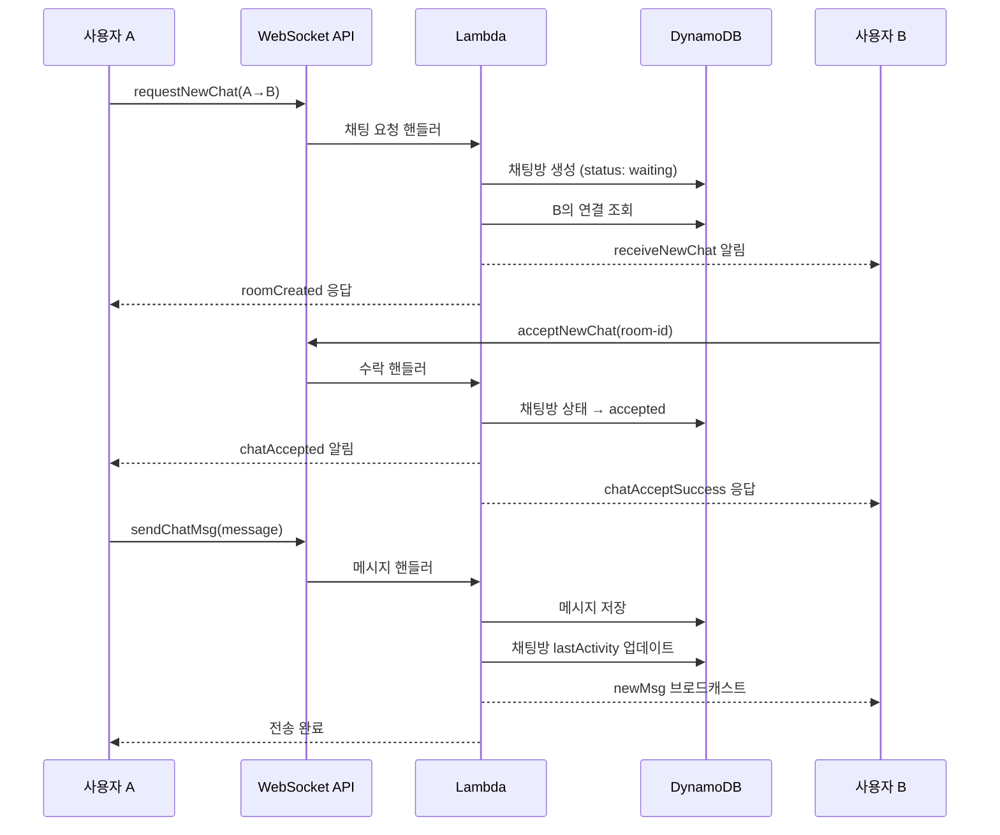

# Foreigner-Citizen Matching Service

외국인과 시민 간의 매칭 및 대화 서비스

## 개요

외국인 관광객과 현지 시민을 연결하여 언어 교환, 관광 가이드, 문화 교류를 돕는 매칭 서비스입니다.

### 🏆 해커톤 개발 배경

이 프로젝트는 해커톤에서 빠른 개발과 확장성을 고려하여 설계되었습니다:

- **빠른 프로토타이핑**: NestJS의 데코레이터 기반 구조로 API 엔드포인트 빠른 구현
- **서버리스 아키텍처**: AWS Lambda를 사용하여 인프라 관리 최소화 및 비용 효율성
- **실시간 통신**: API Gateway WebSocket으로 실시간 채팅 기능 구현
- **NoSQL 데이터베이스**: DynamoDB로 스키마리스 빠른 개발 및 확장성 확보
- **타입 안전성**: TypeScript로 개발 중 오류 최소화 및 코드 품질 보장

### 🎯 핵심 설계 원칙

1. **확장성 우선**: 사용자 증가에 따른 자동 스케일링
2. **개발 속도**: 최소한의 설정으로 빠른 기능 구현
3. **비용 최적화**: 사용량 기반 과금으로 초기 비용 절감
4. **실시간성**: WebSocket을 통한 즉시 메시지 전달

## 주요 기능

- 🔐 **인증 시스템**: JWT 기반 토큰 인증
- 👥 **사용자 관리**: 외국인/시민 사용자 프로필 관리
- 📍 **위치 기반 매칭**: GPS 기반 근처 사용자 찾기
- 💬 **실시간 채팅**: WebSocket 기반 1대1 채팅 시스템
- 🤝 **채팅 요청**: 채팅 요청/수락/거절 플로우
- 📊 **로그 및 통계**: 안전 필터링 및 사용 통계
- 🛡️ **안전 필터**: AI 기반 불안전 콘텐츠 필터링

## 🏗️ 시스템 아키텍처

### 서버리스 WebSocket 채팅 시스템

```
┌─────────────────┐    ┌──────────────────┐    ┌─────────────────┐
│   클라이언트     │────│  API Gateway     │────│   AWS Lambda    │
│   (WebSocket)   │    │   WebSocket      │    │   Functions     │
└─────────────────┘    └──────────────────┘    └─────────────────┘
                                │                        │
                                │                        │
                         ┌──────▼──────┐        ┌──────▼──────┐
                         │ Connection  │        │  DynamoDB   │
                         │ Management  │        │   Tables    │
                         └─────────────┘        └─────────────┘
```

### 기술 스택

- **Backend Framework**: NestJS, TypeScript
- **서버리스**: AWS Lambda (Node.js 18.x)
- **실시간 통신**: AWS API Gateway WebSocket
- **데이터베이스**: Amazon DynamoDB
- **인증**: JWT (JSON Web Token)
- **문서화**: Swagger/OpenAPI
- **배포**: Serverless Framework
- **패키징**: Webpack (Lambda 최적화)

### 🚀 왜 이 기술 스택을 선택했나?

#### 1. AWS Lambda + API Gateway WebSocket
```typescript
// 해커톤에서 이 조합을 선택한 이유:
- 서버 관리 불필요 (인프라 설정 시간 단축)
- 자동 스케일링 (사용자 급증 시 대응)
- 사용량 기반 과금 (초기 비용 절감)
- WebSocket 연결 관리 자동화
```

#### 2. DynamoDB 테이블 설계
```typescript
// 채팅방 테이블 (hh-chat-rooms)
{
  chatroomId: string,        // 파티션 키
  participants: {
    sender: string,
    receiver: string
  },
  status: 'waiting' | 'accepted' | 'rejected' | 'left',
  lastMessage: string,
  lastActivity: number,
  updatedAt: string
}

// 메시지 테이블 (hh-chat-messages)
{
  chatroomId: string,        // 파티션 키
  timestamp: number,         // 정렬 키
  id: string,
  sender: string,
  message: string,
  read: boolean
}

// 연결 관리 테이블 (websocket-connections)
{
  connectionId: string,      // 파티션 키
  userId: string,
  connectedAt: number
}
```

#### 3. Lambda 함수 분리 전략
해커톤에서 빠른 개발을 위해 기능별로 핸들러를 분리했습니다:

- `handleRequestNewChat`: 채팅 요청 생성
- `handleAcceptNewChat`: 채팅 요청 수락
- `handleRejectNewChat`: 채팅 요청 거절
- `handleSendChatMessage`: 메시지 전송
- `handleGetChatHistory`: 채팅 기록 조회
- `handleLeaveChatRoom`: 채팅방 나가기

## API 엔드포인트

### 인증
- `POST /auth/start` - 세션 시작 및 토큰 발급

### 사용자
- `POST /users` - 사용자 생성
- `GET /users/:id` - 사용자 조회
- `GET /users/nearby/:latitude/:longitude` - 근처 사용자 조회
- `PATCH /users/:id/location` - 위치 업데이트
- `PATCH /users/:id/deactivate` - 사용자 비활성화

### 💬 WebSocket 채팅 시스템 구현

#### 🔌 WebSocket 연결 및 인증

```typescript
// WebSocket 연결 설정
const websocket = new WebSocket('wss://your-api-gateway-url/websocket-stage', [], {
  headers: {
    'Authorization': `Bearer ${jwtToken}`
  }
});

// Lambda에서 연결 처리 (websocket.ts)
export const connectHandler = async (event: APIGatewayProxyEvent) => {
  const token = event.headers?.Authorization || event.headers?.authorization;
  // JWT 토큰 검증 후 연결 정보를 DynamoDB에 저장
  await docClient.send(new PutCommand({
    TableName: 'websocket-connections',
    Item: {
      connectionId: event.requestContext.connectionId,
      userId: decodedToken.userId,
      connectedAt: Date.now()
    }
  }));
};
```

#### 🔄 메시지 라우팅 시스템

해커톤에서 빠른 개발을 위해 Action 기반 라우팅을 구현했습니다:

```typescript
// websocket.ts - 메인 라우터
export const messageHandler = async (event: APIGatewayProxyEvent) => {
  const body = JSON.parse(event.body || '{}');
  const { action } = body;

  // 액션별 핸들러 분기
  switch (action) {
    case 'requestNewChat':
      return handleRequestNewChat(event, apiGwClient, docClient);
    case 'acceptNewChat':
      return handleAcceptNewChat(event, apiGwClient, docClient);
    case 'sendChatMsg':
      return handleSendChatMessage(event, apiGwClient, docClient);
    case 'getChatRooms':
      return handleGetChatRooms(event, apiGwClient, docClient);
    // ... 기타 액션들
  }
};
```

#### 🚀 실시간 브로드캐스팅

```typescript
// utils/websocket.utils.ts
export async function broadcastToUsers(
  userIds: string[],
  data: any,
  apiGwClient: ApiGatewayManagementApiClient,
  docClient: DynamoDBDocumentClient
) {
  for (const userId of userIds) {
    // 사용자의 모든 활성 연결 찾기
    const connections = await getUserConnections(userId, docClient);

    for (const conn of connections) {
      try {
        // API Gateway를 통해 메시지 전송
        await apiGwClient.send(new PostToConnectionCommand({
          ConnectionId: conn.connectionId,
          Data: JSON.stringify(data),
        }));
      } catch (error) {
        // 연결이 끊어진 경우 정리
        if (error.statusCode === 410) {
          await removeStaleConnection(conn.connectionId, docClient);
        }
      }
    }
  }
}
```

#### 채팅 요청 플로우
```javascript
// 1. 채팅 요청 보내기
{
  "action": "requestNewChat",
  "data": {
    "sender": "user-id-1",
    "receiver": "user-id-2"
  }
}

// 2. 수신자에게 요청 알림
{
  "action": "receiveNewChat",
  "data": {
    "sender": "user-id-1",
    "senderNickname": "닉네임",
    "chatRoomId": "room-id",
    "receiver": "user-id-2"
  }
}

// 3. 요청 수락
{
  "action": "acceptNewChat",
  "data": {
    "sender": "user-id-1",
    "receiver": "user-id-2",
    "chatRoomId": "room-id"
  }
}

// 4. 요청 거절
{
  "action": "rejectNewChat",
  "data": {
    "sender": "user-id-1",
    "receiver": "user-id-2",
    "chatRoomId": "room-id"
  }
}
```

#### 메시지 전송/수신
```javascript
// 메시지 전송
{
  "action": "sendChatMsg",
  "data": {
    "sender": "user-id",
    "chatroomId": "room-id",
    "message": "안녕하세요!",
    "type": "text",
    "attachments": []
  }
}

// 메시지 수신
{
  "action": "newMsg",
  "data": {
    "chatroomId": "room-id",
    "message": {
      "id": "msg-id",
      "chatroomId": "room-id",
      "sender": "user-id",
      "senderNickname": "닉네임",
      "message": "안녕하세요!",
      "timestamp": 1640995200000,
      "type": "text"
    }
  }
}
```

#### 채팅방 관리
```javascript
// 채팅방 목록 조회
{
  "action": "getChatRooms",
  "data": {}
}

// 채팅 히스토리 조회
{
  "action": "getChatHistory",
  "data": {
    "chatroomId": "room-id",
    "limit": 50,
    "before": 1640995200000
  }
}

// 채팅방 나가기
{
  "action": "leaveRoom",
  "data": {
    "chatroomId": "room-id",
    "userId": "user-id"
  }
}

// 읽음 처리
{
  "action": "openChatRoom",
  "data": {
    "chatroomId": "room-id",
    "userId": "user-id"
  }
}
```

#### 🎯 채팅방 상태 관리

해커톤에서 사용자 경험을 고려한 상태 기반 설계:

```typescript
// 채팅방 상태 흐름
'waiting' → 'accepted' → 'left'
         ↘ 'rejected'

// 상태별 설명
- waiting: 채팅 요청 대기 중 (초기 상태)
- accepted: 채팅 수락됨, 메시지 송수신 가능
- rejected: 채팅 거절됨, 더 이상 진행 불가
- left: 사용자가 채팅방을 나감, 1대1 채팅 종료
```

#### ⚡ 성능 최적화 전략

해커톤에서 구현한 성능 최적화 기법들:

```typescript
// 1. 연결 풀 관리 - 끊어진 연결 자동 정리
const removeStaleConnection = async (connectionId: string) => {
  await docClient.send(new DeleteCommand({
    TableName: 'websocket-connections',
    Key: { connectionId }
  }));
};

// 2. 메시지 배치 전송 - 여러 사용자에게 동시 전송
const broadcastToUsers = async (userIds: string[], data: any) => {
  const promises = userIds.map(userId => sendToUser(userId, data));
  await Promise.all(promises);
};

// 3. DynamoDB 쿼리 최적화 - GSI 활용
const getUserConnections = async (userId: string) => {
  return await docClient.send(new QueryCommand({
    TableName: 'websocket-connections',
    IndexName: 'UserIdIndex',
    KeyConditionExpression: 'userId = :userId',
    ExpressionAttributeValues: { ':userId': userId }
  }));
};
```

#### 🛡️ 에러 핸들링 및 디버깅

해커톤에서 빠른 문제 해결을 위한 로깅 시스템:

```typescript
// chat.handlers.ts에서의 상세 디버깅 로그
export async function handleSendChatMessage(event, apiGwClient, docClient) {
  console.log('🎯 handleSendChatMessage STARTED');
  console.log('🎯 connectionId:', connectionId);
  console.log('🎯 parsed body:', body);

  try {
    // 메시지 저장
    await docClient.send(new PutCommand({...}));
    console.log('🎯 ✅ Message saved successfully');

    // 브로드캐스트
    await broadcastToUsers(participants, messageData, apiGwClient, docClient);
    console.log('🎯 ✅ Broadcast completed successfully');
  } catch (error) {
    console.error('🎯 ❌ Error:', error);
    throw error;
  }
}
```

### 로그 및 통계
- `POST /logs` - 로그 생성
- `GET /logs/user/:userId` - 사용자별 로그
- `GET /logs/room/:roomId` - 채팅방별 로그
- `GET /logs/unsafe` - 안전하지 않은 로그
- `GET /logs/risk-level/:level` - 위험도별 로그
- `GET /logs/stats` - 통계 조회
- `DELETE /logs/:id` - 로그 삭제

## 📊 데이터 흐름 및 시퀀스

### 채팅 요청부터 메시지 전송까지의 전체 흐름



### 🗄️ DynamoDB 테이블 상세 설계

해커톤에서 빠른 쿼리를 위한 테이블 구조:

```typescript
// 1. 채팅방 테이블 (hh-chat-rooms)
{
  // 기본 키
  chatroomId: string,              // PK: 채팅방 고유 ID

  // 참가자 정보
  participants: {
    sender: string,                // 요청자 userId
    receiver: string               // 수신자 userId
  },

  // 채팅방 메타데이터
  status: 'waiting' | 'accepted' | 'rejected' | 'left',
  lastMessage: string,             // 마지막 메시지 내용
  lastActivity: number,            // 마지막 활동 timestamp
  updatedAt: string,               // ISO 날짜 문자열

  // UI 표시용 정보 (선택적)
  participantInfo?: {
    sender: { userId: string, nickname: string },
    receiver: { userId: string, nickname: string }
  },
  unreadCount?: number,            // 읽지 않은 메시지 수
  metadata?: Record<string, any>   // 확장용 필드
}

// GSI: sender-receiver 조합으로 기존 채팅방 검색
// GSI1PK: sender + "#" + receiver
// GSI1SK: status
```

```typescript
// 2. 메시지 테이블 (hh-chat-messages)
{
  // 복합 기본 키
  chatroomId: string,              // PK: 채팅방 ID
  timestamp: number,               // SK: 메시지 시간 (정렬용)

  // 메시지 내용
  id: string,                      // 메시지 고유 ID (UUID)
  sender: string,                  // 발신자 userId
  senderNickname: string,          // 발신자 닉네임 (UI용)
  message: string,                 // 메시지 내용

  // 메시지 메타데이터
  type: 'text' | 'image' | 'system', // 메시지 타입
  attachments?: string[],          // 첨부파일 URL 배열
  read: boolean                    // 읽음 여부
}

// 쿼리 패턴: chatroomId로 시간순 메시지 조회
// Query: PK=chatroomId, SK > timestamp (페이지네이션)
```

```typescript
// 3. WebSocket 연결 테이블 (websocket-connections)
{
  // 기본 키
  connectionId: string,            // PK: API Gateway 연결 ID

  // 사용자 정보
  userId: string,                  // 연결된 사용자 ID
  connectedAt: number,             // 연결 시간 timestamp

  // 연결 메타데이터
  userAgent?: string,              // 클라이언트 정보
  ipAddress?: string               // IP 주소
}

// GSI: userId로 사용자의 모든 활성 연결 조회
// GSI1PK: userId
// GSI1SK: connectedAt
```

### ⚙️ 핵심 유틸리티 함수들

```typescript
// 기존 채팅방 검색 (중복 요청 방지)
const findExistingRoom = async (senderId: string, receiverId: string) => {
  const roomId = [senderId, receiverId].sort().join('_');
  return await docClient.send(new GetCommand({
    TableName: 'hh-chat-rooms',
    Key: { chatroomId: roomId }
  }));
};

// 사용자별 활성 WebSocket 연결 조회
const getUserConnections = async (userId: string) => {
  return await docClient.send(new QueryCommand({
    TableName: 'websocket-connections',
    IndexName: 'UserIdIndex',
    KeyConditionExpression: 'userId = :userId',
    ExpressionAttributeValues: { ':userId': userId }
  }));
};

// 채팅방의 시간순 메시지 조회 (페이지네이션)
const getChatHistory = async (chatroomId: string, limit = 50, before?: number) => {
  const params = {
    TableName: 'hh-chat-messages',
    KeyConditionExpression: 'chatroomId = :chatroomId',
    ExpressionAttributeValues: { ':chatroomId': chatroomId },
    ScanIndexForward: false,  // 최신 메시지부터
    Limit: limit
  };

  if (before) {
    params.KeyConditionExpression += ' AND #timestamp < :before';
    params.ExpressionAttributeValues[':before'] = before;
    params.ExpressionAttributeNames = { '#timestamp': 'timestamp' };
  }

  return await docClient.send(new QueryCommand(params));
};
```

## 🚀 개발 환경 설정

### 설치
```bash
npm install
```

### 개발 서버 실행
```bash
npm run start:dev
```

### 빌드
```bash
npm run build
```

### 테스트
```bash
npm run test
```

## API 문서

개발 서버 실행 후 다음 URL에서 Swagger 문서를 확인할 수 있습니다:
- http://localhost:3000/api

## 배포

```bash
npm run serverless:deploy
```

## 라이센스

MIT License